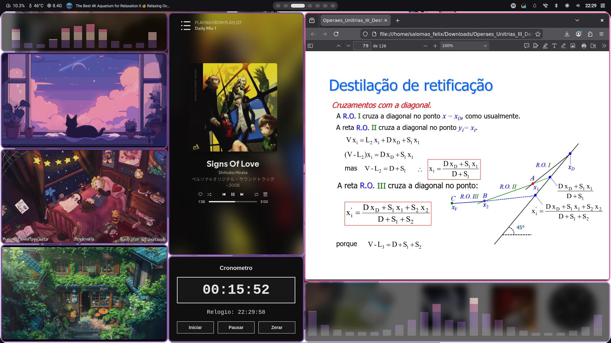

# Cronometro Simples em PyQt5

Aplicativo desktop simples com duas funcoes:

- cronometro contando tempo
- relogio mostrando a hora atual do sistema

## Preview



## Arquivos

```text
stopwatch-pyqt5/
├── assets/
│   └── cronometro-preview.png
├── README.md
├── requirements.txt
└── stopwatch_pyqt5.py
```

## Requisitos

- Python 3
- PyQt5

## Instalacao

```bash
python3 -m venv .venv
source .venv/bin/activate
pip install -r requirements.txt
```

## Execucao

```bash
python3 stopwatch_pyqt5.py
```

## Controles

- `Iniciar`: comeca a contar
- `Pausar`: pausa a contagem
- `Zerar`: volta para `00:00:00`
