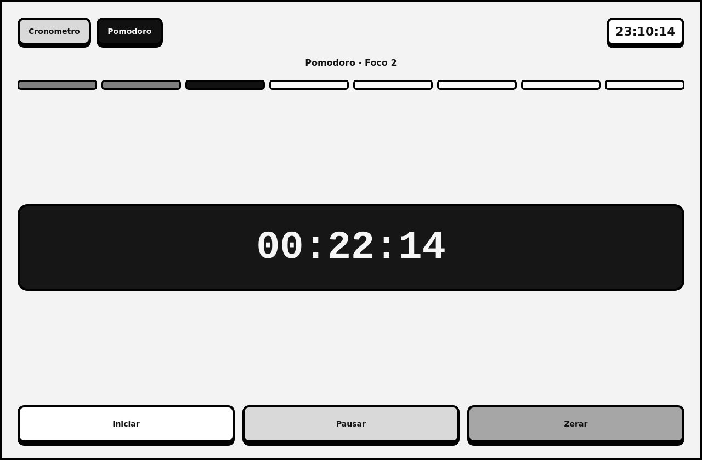

# Cronometro Simples em PyQt5

Aplicativo desktop em PyQt5 com interface monocromatica e dois modos de uso:

- cronometro livre com contagem progressiva
- pomodoro com ciclos de foco e pausa
- relogio com hora atual do sistema

## Preview

### Cronometro


### Pomodoro



## Arquivos

```text
cronometro/
├── assets/
│   ├── cronometro-preview.png
│   └── pomodoro-preview.png
├── Cronometro.py
├── README.md
├── requirements.txt
```

## Requisitos

- Python 3
- PyQt5

## Instalacao

```bash
python3 -m venv .venv
source .venv/bin/activate
pip install -r requirements.txt
```

## Execucao

```bash
python3 Cronometro.py
```

## Modos

- `Cronometro`: conta o tempo continuamente
- `Pomodoro`: alterna entre blocos de foco e pausa

## Ciclo Pomodoro

- 25 minutos de foco
- 5 minutos de pausa
- 25 minutos de foco
- 5 minutos de pausa
- 25 minutos de foco
- 5 minutos de pausa
- 25 minutos de foco
- 15 minutos de pausa longa

## Controles

- `Iniciar`: inicia o cronometro ou o ciclo pomodoro atual
- `Pausar`: pausa a contagem atual
- `Zerar`: reinicia o cronometro ou volta o pomodoro para a primeira etapa
- `Cronometro`: troca para o modo de contagem progressiva
- `Pomodoro`: troca para o modo de foco com marcacoes visuais das etapas
